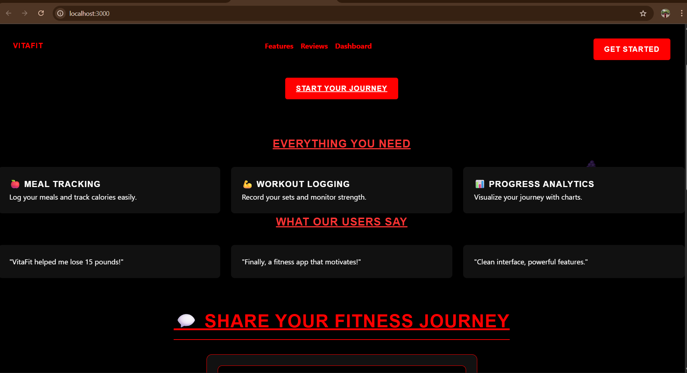

# 💪 VitaFit - Your Personal Fitness Companion  

VitaFit is a modern fitness web application that helps users **track meals, log workouts, analyze progress, and share their fitness journey** with a supportive community.  
Built with **HTML, CSS, and JavaScript**, VitaFit combines sleek design with interactive features to keep users motivated.  

---

## 🚀 Features  

- 🍎 **Meal Tracking** – Log your meals and track calories.  
- 💪 **Workout Logging** – Record sets, reps, and exercises.  
- 📊 **Progress Analytics** – Visualize your fitness journey with interactive charts.  
- 💬 **Community Feed** – Share your progress with images and posts (like a fitness Instagram).  
- ⭐ **Testimonials** – See what other users say about VitaFit.  
- 🔥 **Animated Background** – Floating dumbbells & healthy food emojis for a fun vibe.  
- 🖤 **Dark Theme with Red Accents** – Fitness-inspired styling for motivation.  

---

## 🖼️ Preview  

![VitaFit Screenshot] 


---

## 🛠️ Tech Stack  

- **Frontend:** HTML5, CSS3, JavaScript  
 -**Animations:** CSS Keyframes  

---

## 📂 Project Structure  
VitaFit/
│── index.html # Main HTML file
│── style.css # Styles (dark theme + animations)
│── script.js # Functionality (tracking, posting, dashboard)
│── README.md # Project documentation
│── screenshot.png # Preview image (add manually)


---

## ⚡ How to Run  

1. Clone the repository:  
   ```bash
   git clone https://github.com/stutikatiyar/Runtime_Terror.git
   cd VitaFit
2.Open Index.html in your browser.
